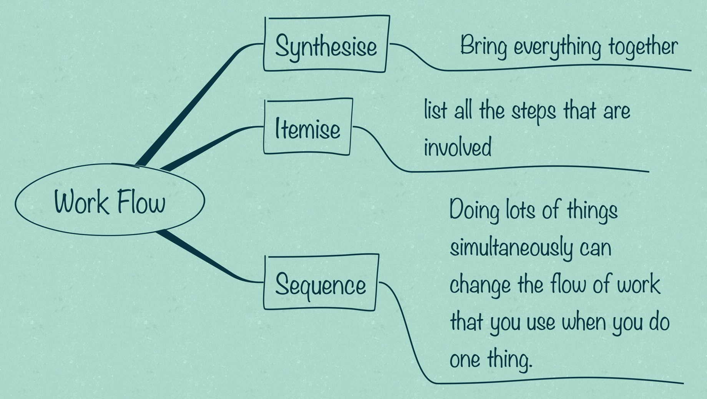

# Automating your Work

## Getting Started

### Starting Small 

Use automation tools to engage with the fiddly bits that take so much time. There are plenty of ways to begin, from very simple things, like setting reminders or dialling the phone, to quite complex work processes that will watch your web site, transfer data into your your spreadsheets, and alert you only if it is important. 

Start experimenting with what you can do with your phone, tablet, laptop and desktop. Telling your computer to check your mail, or telling your phone to call someone, is odd at first. But it can be much faster than when you do it manually. Something as simple as making a phone call involves quite a few steps. 

1. picking up the phone
1. switching to the phone call app
1. finding the number (even if it's a favourite), 
1. then initiating the call

The alternative is to tell your digital assistant to make the call,  "Hey Siri", "Alexa", "Hi Bixby" or "OK google" - "Call Janni". Your phone or computer will start the call. You don't even need to pick up the phone until they have answered. 

Setting reminders and calendar dates is just as easy. "Hey Siri! Schedule a meeting with Anna tomorrow at 2pm". There is no way that you can do that faster with your fingers and thumbs! 

``TIP``  *Voice assistants learn through practice, the more you use them, the better they are.*

``CRAP`` *Noisy environments interfere with the voice assistant's ability to understand you.*

 ### Gearing Up

If your geek rating is ``*fluffy*`` then setting up an n8n.io workflow may seem like torture but the odds are that someone in your network will be able to set them up without blinking. 

There are many tasks which can be managed by workflows. As an administrator or a coordinator, ***you don't want your hours chewed up*** by logins, password resets, switching between apps, download/upload cycles, and so on and so on. Any task that occurs frequently and is computer based is a candidate for a workflow.

## Arranging your Workflow

When you have lots of the same thing to do, something that you will repeat, you want to have a strategy that scales well. You want to reduce the amount of time required to do the work and you don’t want to repeat things unnecessarily.   
  
The first thing to think about is which parts of the job can be synthesised. Some parts of the job are unique and have to be done individually. Some parts of the job are common to every item and these are the things that you want to do once or as little as possible.   
  
When you do a job once you start at the beginning and work through to the end. Most of us will have a sequence for performing jobs that makes sense and it works. Lots of jobs have sequence that you need to follow. There are things that go first and things that go last. But in the middle the sequence might not matter much. When you are doing a task a lot you’ll probably find that some ways are quicker or easier than others and these become your preferred technique.   
  
When you break the jobs into the parts that are common and the parts that are unique it will probably upset your normal sequence. You might need to do all of the unique things first, then do all of the common things, or _vice versa_.   
  
Another thing that you may find is that you are using tools are designed to do one job at a time. This forces you to repeat your work. You want to find tools that allow you to batch actions together, or find new ways to use your tools.   
  
You’ll also notice that the some of the common tasks you can do once to all of the items. Doing something once is a good thing for humans. But some of the common tasks you will have to do over and again for every item. Doing something over and again is a good job for robots.  

## Digital Assistants

Computers, phones, watches, speakers, TV's, and a lot of other things, are able to respond to voice activated commands. We suggest that you get into the habit of telling your things what to do, they can pick up the slack, leaving you free for more important things.

> 💡 Digital assistants are surprisingly easy to use and productive

### Siri

Siri  is a virtual assistant that is part of Apple Inc.'s iOS, iPadOS, watchOS, macOS, tvOS, and audioOS operating systems. It uses voice queries, gesture based control, focus-tracking and a natural-language user interface to answer questions, make recommendations, and perform actions by delegating requests to a set of Internet services. With continued use, it adapts to users' individual language usages, searches and preferences, returning individualised results.

**Siri and Shortcuts**  
Shortcuts are workflows that you set up to perform specific tasks. They can be simple, or quite complex and involve different behaviour ( logic forks ) depending on the situation. You can use voice commands to Siri to run shortcuts. 

### Cortana

Cortana is a virtual assistant developed by Microsoft which uses the Bing search engine to perform tasks such as setting reminders and answering questions for the user.

In January 2020, the Cortana mobile app was removed from certain markets and <u>on the 31st of March 2021, the Cortana mobile app was shut down globally.</u>

### Alexa
Amazon debuted Alexa with the Echo smart speakers back in November 2014. Alexa can also control several smart devices using itself as a home automation system. Users are able to extend the Alexa capabilities by installing "skills" (additional functionality developed by third-party vendors, in other settings more commonly called apps) such as weather programs and audio features. It uses automatic speech recognition, natural language processing, and other forms of weak AI to perform these tasks.

### Google
Google launched Assistant back in May 2016, along with messaging app Allo and the smart speaker line Google Home. Unlike its predecessor Google Now, it can participate in two-way conversations with the user. The AI assistant became exclusive on Pixel smartphones for a period, but it’s now available on almost all modern Android devices. These include third-party smartphones and smart home appliances. This enables users to control the lights, thermostats, and cameras in their homes through voice prompts. Setting up “routines” is also possible. Routines are a string of commands or tasks activated with only a single phrase. Google Assistant is present too in some car models of Audi and Volvo through the Android Auto app.

Moreover, the digital assistant sports an Interpreter Mode. The feature helps conduct conversations in a long list of languages. Users can receive spoken or written translations in real-time to aid dialogue. Google Assistant is also available on iOS devices through a smartphone app. The company also announced that it will be able to recognise objects and collect visual data via device camera. 

### Bixby
Bixby is a virtual assistant developed by Samsung Electronics. It represents a major reboot for S Voice, Samsung's voice assistant app introduced in 2012 with the Galaxy S III. S Voice was later discontinued on 1 June 2020. In May 2017, Samsung announced that Bixby would be coming to its line of Family Hub 2.0 refrigerators, making it the first non-mobile product to include the virtual assistant.

## Automation Tools

### Automate.io

:link: <https://automate.io> 

``FREE TIER``  5 bots, 300 actions per month

Automate.io lets you connect various cloud applications you use - marketing, sales, payments, web forms, collaboration, email and automate routine tasks. Create simple one to one integrations, or multi-app workflows across them. Automate.io supports - Google Apps, Slack, Trello, Salesforce, Pipedrive, MailChimp, Infusionsoft, Zendesk, Quickbooks and 100+ other popular apps.

### Power Automate
<https://powerautomate.microsoft.com/en-us/>

``FREE TIER``   *It's complicated, but there is a free tier.* 

Power Automate is a service for automating workflow across the growing number of apps and SaaS services that business users rely on. Streamline repetitive tasks and paperless processes. 

This is the Microsoft work flow tool and is built-in for Windows 11 users.  Windows 10 users can [download the desktop RPA tool](https://go.microsoft.com/fwlink/?LinkId=2102613&clcid=0x409)

If you have a Microsoft Account, such as Microsoft 365, you can [use Power Automate via your Microsoft Account.](https://docs.microsoft.com/en-us/power-automate/desktop-flows/getting-started-msa) and the results are saved in your OneDrive. 

- [Power Automate Getting Started Guide](https://aka.ms/PowerAutomate-Win11-Getstarted)

### n8n.io

<https://n8n.io>

``FREE TIER`` fair-code licensed - Apache 2.0 with Commons Clause

n8n is a free Node-based source-available Workflow Automation Tool. It can be self-hosted, easily extended, and so also used with internal tools. 

n8n (pronounced n-eight-n) helps you to interconnect every app with an API in the world with each other to share and manipulate its data without a single line of code. It is an easy to use, user-friendly and highly customizable service, which uses an intuitive user interface for you to design your unique workflows very fast. 

An example video showing you how to [create workflows from web forms to trello cards](https://docs.n8n.io/getting-started/create-your-first-workflow/get-product-feedback/)

**Desktop app**

The n8n desktop app is the fastest way to try n8n on Windows or Mac computers (support for Linux is coming soon). 

:link: [Download for Windows](https://downloads.n8n.io/file/n8n-downloads/n8n-win.zip)  
:link: [Download for macOS](https://downloads.n8n.io/file/n8n-downloads/n8n-mac.zip)

### Integromat

<https://www.integromat.com>

``FREE TIER`` 1,000 Operations, 100 MB Data transfer, 15 minute interval

Integromat will automate processes that you currently handle manually. It is not only capable of connecting apps but can also transfer and transform data. It works 24 hours a day, seven days a week and does not require your intervention. 

### IFTTT

<https://ifttt.com>

``FREE TIER`` 5 Applets, Standard Applet speeds

IFTTT is short for If This Then That, and is the best way to integrate apps, devices, and services. We help devices, services, and apps work together in new and powerful ways.

IFTTT was founded on the belief that every thing works better together. Tech incompatibility has become challenging for anyone trying to build a smart home or create automatic routines in their life. IFTTT makes it easy.
