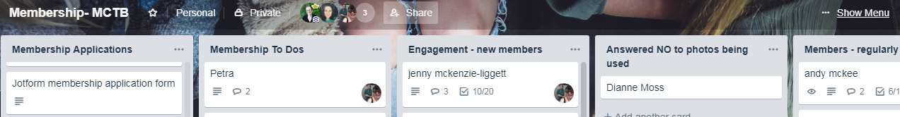
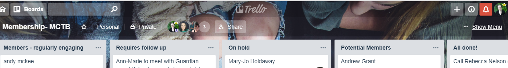

# Membership and Administration

## When setting up a Timebank you will need to decide on a sign-up process.

Can the person sign up solely online or do they need to meet in person? Here is an example of a sign up process: [Timebank Membership Workflow](https://docs.google.com/document/d/1aX72oQ8eHg-DUvBkyz47sffFZZ38cxj-LiOR9mYOI5s/edit). Note: This process includes a Ministry Of Justice (MOJ) check.

_This image shows some of the options that may be included in the "onboarding" of new members; the example linked just above uses most of the options. Not all timebanks do, depending their size and location; it's about what will support trust and engagement_.

If you decide it can be done online then you can either use CommunityWeaver3 (CW3) directly - you will receive an email when a new member signs up, and you can then respond directly to this with an email with sign up details. Here's an [example email](https://docs.google.com/document/d/1q1QbZX53q4rygu3c_iIsbTDhAoqq25Eisecd4m2jy9g/edit#bookmark=id.6huvpiuivb0q).

⚠️ A number of coordinators told the toolkit team that the information collected by CW3 is _not enough!_ That's why many timebanks start with a "form", like a survey or online application tool, and then ask people to join CW3 as an additional action (see Template 1 in the example email above).

### Custom Sign-up Procedures

*If you use CW3 and you have a custom sign up form, you need to turn option “allow anyone to signup” option OFF and redirect users to your sign up form. CW3 doesn’t make it easy to roll-your-own sign up procedure. The best that we can suggest is that you use a “Special Page” that is pinned to your home page. In that page you can direct users to your custom built signup form.*

There are many ways to present potential users with a different sign-up form. The [office suites from Google, Microsoft and Zoho](OfficeSuites.md) that we discuss all offer the ability to generate online forms. 

There are also services that use forms as their reason for being. 

All of these, the office tools and the specialist tools, can be integrated with other services. 

[Airtable](https://www.airtable.com) ``Free Tier`` Unlimited bases, 1,200 records per base, 2GB of attachments per base   
[Jotform](https://www.jotform.com)  ``Free Tier`` 5 Forms, 100 submissions per month  
[Survey Monkey](https://www.surveymonkey.com) Basic plan ( free ) is crippled   
[Type Form](https://www.typeform.com) ``Free Tier`` 10 questions per form, 10 submissions per month  

When you use online forms, such as this [Jot Form](http://form.jotform.co/72362960301854) and this [Google Form](https://docs.google.com/forms/d/1q-hw5Qgo5Tejgci-n2oolA-McxZBhy-oh9api9Lw8jY/edit) they will create a user database automatically. These can be sent to [Google Sheets](https://www.jotform.com/help/228-how-to-integrate-forms-with-google-sheets/) or [Airtable](https://www.jotform.com/integrations/airtable), where new members are immediately placed into your spreadsheets. 

These automatic tasks are called "integrations" and provide you with lots of possibilities. You could also use an integration to send an automatic email; for example: [Jot Form's MailChimp integration](https://www.jotform.com/integrations/mailchimp). You'll find that many popular services already have integrations, and even if they do not there are tools to help bridge those gaps, too! A couple of timebanks, like Wellington and Addington, use [Zapier](https://zapier.com/) for this.

## Did everyone finish all the steps? 

Keeping track of where people are at in the sign-up process (or onboarding) can be tedious, but it's important to make sure as many people as possible make it across the finish line, and a little support at key steps can sometimes help to make sure people don't fall through the cracks.

Because it is a lot of effort for the coordinator, it's good to emphasise self-responsibility and make it possible for people to manage the process themselves. To that end, [here's a document used by Wellington for this purpose](https://docs.google.com/document/d/1QohoeF2x2u6Jd0ZjTrWHhBckYo9rbARhRGlVbe1o9OE/edit); you can see how it shows people the different steps they need to accomplish (and how to…).

That said, many timebank coordinators use [Trello](https://trello.com) or a document they store in the cloud – often a Google Doc – to see who is at what stage in the journey. What these solutions have in common is that they enable you to see all the different people who are at a common step in the journey, so that if you want to send messages encouraging them along, you can do as much copy/paste or bcc'ing as possible to reduce the workload.

_Example Trello dashboard from MCT_

Trello let's you simply drag and drop "cards" that, as in the above example, may each correspond to one person. The cards can have more details hidden inside, like contact details, creating a nice, clean dashboard that also has everything to hand.

💡 Timebanks like Wellington Timebank and Addington Timebank have created automations using Zapier that make their management with Trello, and related outreach emails they have to send, even more quick and easy. 

Some examples are: 
* Google form to Trello 
* Google form to Gmail sign-up email
* Google form to Referee check email

You can connect pretty-much anything, so don't be limited. Take a [look at the automation tools available](Automate.md).  If you want to get some first-hand advice contact the Wellington Timebank and Addington Timebank for recommendations.

### Reference checks for new sign ups

If you decide to do reference checks, there are a variety of ways to check in with the "referees" your potential member has made available for you to contact - you could do it the old fashioned way by calling the referees, or you could use an online form, a questionnaire they can fill out at any time (this can save time playing 'phone tag' and make emailing referees simpler). [Here is an example of a form for referees](https://docs.google.com/forms/d/1M2FeahoeAsj_bykBzbHVlYbnYZo-lmh4ytXcfiaBiOM/edit).

### Code of Conduct for your timebank

You may want to establish a formal code of conduct to help build a healthy culture (and trust) in your timebank. Here's an example [code of conduct (for printing out)](https://docs.google.com/document/d/1SxoA0sDgS-nIdRFcdNO_9v1awpeoo-Q7-BfRKNyU-ek/edit?usp=sharing), but you can save some time and hassle by having people fill it out online: [this example](https://docs.google.com/forms/d/e/1FAIpQLScAl_eN-I9tiIjfa7beo9aqjIDy1l03X44VMLGP3rAZm20Gug/viewform?usp=sf_link) is more interactive and engaging, too!

### Do you want to do police checks? 

This is, again, about trust. We heard a number of different approaches, from no checks (and even no referees, in small, rural communities) all the way to official checks. Some timebanks require Police checks _only_ when and if someone wants to offer a social service involving vulnerable peoples like babysitting or elder care, or if they disclose having something on their record (like in this [membership form from MCT](https://form.jotform.co/72362960301854)). Some timebanks avoid this by discouraging these altogether. You will want to make a choice based on where you are – what feels safe enough, and encourages people to have trust in the system and the people with whom they interact.

In New Zealand you can obtain a [Ministry of Justice criminal (MOJ) record check](https://www.justice.govt.nz/criminal-records/get-someone-elses/) or do the more comprehensive (and time expensive) [Police Vetting](https://www.police.govt.nz/advice/businesses-and-organisations/vetting).

There are small fees for both of these services. At the time of writing it they were about $11 per request.

💡  [individuals can apply to obtain their own criminal record](https://www.justice.govt.nz/criminal-records/get-your-own/) from the Ministry of Justice. At the time of writing it’s free to request a copy of your own criminal record. 

Organisations providing services to vulnerable people (this includes children, older people and people with special needs) can ask the [New Zealand Police to vet](https://www.police.govt.nz/advice/businesses-and-organisations/vetting) (check) people who want to work or volunteer for them.

#### Compliance for organisations that do criminal record checks

Organisations that request criminal records checks [must  demonstrate that they understand the laws that apply](https://www.justice.govt.nz/criminal-records/get-someone-elses/compliance-assurance-check/). The compliance checks must be performed every year. 

### Do you want to do an orientation? 

Think about what stage in the process that you want to organise an orientation. This document lays out [a plan for the important steps to cover from sign-up to orientation](https://docs.google.com/document/d/1unViW-gAMgcoyXf_9eGpXqm_ElzC81EW/edit?usp=sharing&ouid=107264652407614741759&rtpof=true&sd=true).

At an orientation the new member can learn about Timebanking - and discover what further steps are needed to join. Many coordinators treasure this opportunity to help people identify and share their talents, and also acknowledge their needs and get comfortable making requests.

Here is a [sample agreement form for members](https://docs.google.com/document/d/1H38uPwDBd_zU3FfH9PCmPNTJDdz4KWJF/edit?usp=sharing&ouid=107264652407614741759&rtpof=true&sd=true). 

Here is a [Sign Up and Orientation Procedure](https://docs.google.com/document/d/1Ur4KnHxYjW8xIW5hbzPwzEW8-Vlze7-PLewuktXrqWs/edit?usp=sharing) for people running orientations (from Wellington Timebank). 

#### Orientation handouts

You might consider making a simple one-page handout ([example](https://docs.google.com/document/d/18YtmQon3tks6iQxd4uKI-0vYjvG7EIXF/edit?usp=sharing&ouid=108339832239132249427&rtpof=true&sd=true)), or a full guide to the steps ahead as in this Wellington example of an [orientation-day handout for new members](https://docs.google.com/document/d/1QohoeF2x2u6Jd0ZjTrWHhBckYo9rbARhRGlVbe1o9OE/) or Coastal New Brighton's [handbook](https://drive.google.com/file/d/1fiWuc0CMnQKZ89GQ9VKBDBOgtju48ys_/view?usp=sharing).

## Now you have a new member!
Once the person is signed up they will need to become a member of the platform you are using. 

If they haven't already signed onto the platform at the start of the process, you want to ensure that they get onto your platform and become familiar with it. 

Orientation days offers a chance to do this. If you have a group they can be self-assisting, and that encourages them to meet one another.
 
